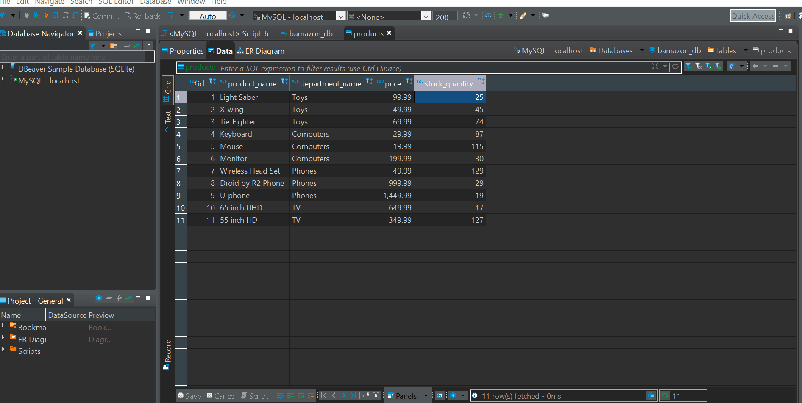

# BAM! azon
#### This file is to be viewed in Preview Mode or direct from GitHub

Welcome to Bam! azon ()
Bam! azon is a shopping program that will display the items for sale, take the order, check oder against inventory, and if there is enough inventory in stock, it will then fill the order and update inventory, use a SQL database

### Prerequisites
To run Bamazon you will need to install the following npm packages
mysql
inquirer

### Installing
The above can all be installed by typing 'npm install'

## Getting Started
Bamazon will show you the current items for sale, please enter in the ID number of the item that you wish to pruchase, followed by the quanity that you wish to purchase.  You will then be notified if we can fill the order and if so that total cost.
Thank you for using Bamazon!

## Video of progam in use

#### Will self run in preview mode, or direct from GitHub
Please hold applause till the end!

*  - working gif

## Contributing
A node.js/SQL db file by Joseph Falconettti

## Versioning
Ver 1.0.0

## License
FL Drivers #007
To kill or be killed

